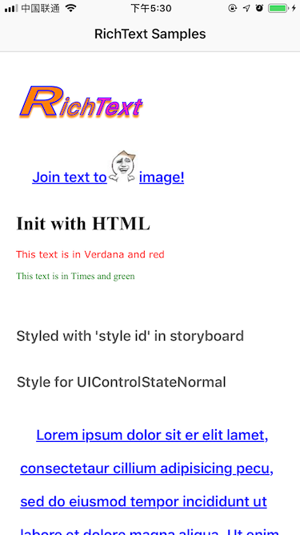

## RichText

[](https://travis-ci.org/cheng4741@qq.com/RichText)
[](http://cocoapods.org/pods/RichText)
[](http://cocoapods.org/pods/RichText)
[](http://cocoapods.org/pods/RichText)




使用`NSAttributedString`来创建一个富文本是一件很繁琐闹心的事，各种又长又难记的属性字典，不仅写起来费时，代码的可读性也不是很好。`RichText` 是基于`NSAttributedString`的一层轻量级的封装，可以用它来代替`NSAttributedString`/`NSMutableAttributedString `，实现各种富文本。

`RichText`主要是使用方法链来流畅地创建完一个富文本。添加属性，改变范围，匹配正则，拼接字符串，都仅仅是调用一个简短的方法。

举个例子，创建一个简单的富文本，数字变红，最后3个字加粗，对比一下，下面是效果图：


使用NSAttributedString

```objectivec
    NSMutableAttributedString * attrStr = [[NSMutableAttributedString alloc]
                                           initWithString:@"恭喜你获得50金币，以及10元现金奖励，可提现"];
    [attrStr addAttribute:NSFontAttributeName
                    value:[UIFont systemFontOfSize:14]
                    range:NSMakeRange(0, attrStr.length)];
    NSError *err = nil;
    NSRegularExpression *regExp = [NSRegularExpression
                                   regularExpressionWithPattern:@"\\d"
                                   options:NSRegularExpressionCaseInsensitive
                                   error:&err];
    NSAssert(err == nil, err.localizedDescription);
    [regExp enumerateMatchesInString:attrStr.string
                             options:NSMatchingReportCompletion
                               range:NSMakeRange(0, attrStr.length)
                          usingBlock:^(NSTextCheckingResult * _Nullable result,
                                       NSMatchingFlags flags, BOOL * _Nonnull stop) {
        if (result.range.location != NSNotFound) {
            [attrStr addAttribute:NSForegroundColorAttributeName
                            value:UIColor.redColor
                            range:result.range];
        }
    }];
    [attrStr addAttribute:NSFontAttributeName
                    value:[UIFont boldSystemFontOfSize:14]
                    range:NSMakeRange(attrStr.length - 3, 3)];
    
```

使用RichText

```objectivec
@"恭喜你获得50金币，以及10元现金奖励，可提现"
    .setFont(UIFont.regular(14))
    .matches(@"\\d")//选中数字
    .setColor(UIColor.redColor)//设置颜色
    .last(3)//选中最后3个
    .setFont(UIFont.bold(14));
```

## How to use

RichText 包含了以下3个协议

* RTText（主要负责适配不同类型）
* RTRangeable（改变选中范围）
* RTStyleable（对选中的部分进行处理，比如着色，加粗，加阴影）


RichText操作流程跟我们平时使用文本处理软件是类似的，主要是一下两步：

1. 选中要处理那部分文本（**默认选中全部文本**，对应的操作是`RTRangeable`协议里的方法）
2. 对选中的部分处理，比如着色，加粗，加阴影（对应的操作是`RTStyleable`协议里的方法）

```objectivec
@"RichText"
    .setColor(UIColor.magentaColor) //设置颜色
    .setStrokeColor(UIColor.blueColor) // 设置描边颜色
    .setStrokeWidth(-3) // 设置描边宽度
    .setShadow(shadow) // 设置阴影
    .rangeTo(4) // 选中范围
    .setColor(UIColor.orangeColor) // 给前4个设置颜色
    .matches(@"R") // 匹配指定范围
    .setExpansion(0.5) // 拉伸或压缩
```

NSAttributedString 和 NSString 实现了以上3个协议的，你完全可以把它们当RTText类型用。RTText对象也可以通过attributedString属性转成NSAttributedString类型，以下两种方式是等价的：

```objectivec
    self.label.attributedText = @"RichText"
    .setKern(1) //设置字间距
    .setColor(UIColor.magentaColor)
    .attributedString;
```

```objectivec
    self.label.richText = @"RichText"
    .setKern(1) //设置字间距
    .setColor(UIColor.magentaColor);
```

UIImage 也实现了RTText协议，所以你可以很方便地插入UIImage到富文本中：

```
    UIImage *image = [UIImage imageNamed:@"smile"].withSize(80,80);
    self.label2.richText = @"richtext"
                            .join(image)
                            .setStyle(style2);
```

## Example

To run the example project, clone the repo, and run `pod install` from the Example directory first.

## Installation

RichText is available through [CocoaPods](http://cocoapods.org). To install
it, simply add the following line to your Podfile:

```ruby
pod 'RichText'
```

## Author

cheng4741@qq.com

## License

RichText is available under the MIT license. See the LICENSE file for more info.
